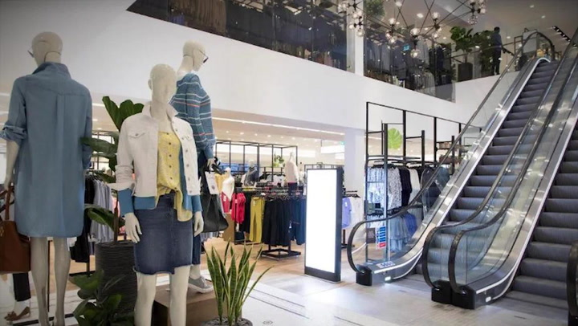

## **Fashion Sales Dashboard**

## **Project Objectives**
The objective of this project is to create a comprehensive Power BI dashboard utilizing the data collected from the data professional survey. The dashboard aims to provide meaningful insights and visualizations regarding various aspects of the data professionals' roles, career paths, job satisfaction, salary ranges, demographics, and more. By leveraging Power BI's interactive features and visual capabilities, the objective is to present the survey data in an intuitive and impactful manner, enabling users to explore and understand the key findings and trends within the data professional community.

## **About the Dataset**
The dataset contains the sales data for the two fashion stores in Australia, Fashions Direct and Next Look. It is well organized in an Microsoft Excel table format, which is convenient for data analysis. The data includes various columns such as `date`, `financial year`, `chain, location`, `manager`, `product category`, and `product buyer`.

The main data is available in the sheet named `Data` and covers the period from January 2016 through June 2017, comprising approximately 68,000 rows. Additionally, there is an additional dataset for August 2017 that contains around 4,500 rows.

## **Project Files**
Dashboard: This contains all the visuals used in this project.

Fashion Sales.xlsx: This is the dataset for the project.

## **Questions to Answers**

1. What is the total sales ganered from each sales store?
2. What is the total sales, indicating their trends by state?
3. Whao are the top five (5) managers by total sales?
4. What is the distribution of sales by category?
5. What is the sales trend (by year and month) by chain?
6. What is the distribution of sales by managers?

## **Data Analysis Process**

1. Define the objectives: Clearly define the objectives of your dashboard. What key insights do you want to extract from the data? What questions do you want to answer? This will help guide your analysis and visualization choices.
2. Import and clean the data: Open the "Fashion Sales.xlsx" file in Excel and import the data into a new worksheet. Review the data for any inconsistencies, missing values, or errors. Clean the data by performing necessary transformations, such as removing duplicates, handling missing values, and formatting columns appropriately.
3. Identify key metrics and dimensions: Determine the key metrics and dimensions that will drive your analysis. In this case, some potential metrics could be total sales, sales trends, top managers, sales distribution by category, and sales distribution by chain.
4. Perform data analysis: Use Excel's built-in functions and formulas to perform various data analysis tasks. For example:
>To calculate the total sales generated from each sales store, you can use the SUMIFS function to sum the sales based on the store name.
>To analyze the sales trends by state, you can create a pivot table or use the SUMIFS function with a criteria range for the state column.
>To identify the top five managers by total sales, you can use the SUMIFS function and rank the managers based on their sales values.
>To analyze the distribution of sales by category, you can create a bar chart or use the COUNTIFS function to count the occurrences of each category.
>To analyze the sales trend by year and month for each chain, you can use the SUMIFS function with criteria ranges for the year, month, and chain columns.
>To analyze the distribution of sales by managers, you can create a pivot table or use the SUMIFS function with a criteria range for the manager column.
5. Create interactive visualizations: Excel offers various visualization tools to create interactive charts and graphs. Select the appropriate visualization type for each analysis and customize the visuals to enhance readability and interactivity. You can create charts, pivot tables, slicers, and conditional formatting to allow users to interact with the data and explore different perspectives.
6. Design the dashboard layout: Organize your visualizations in a logical and visually appealing manner. Use worksheets or separate sections within a worksheet to present different analysis views. Add titles, headings, and labels to provide context and guide users through the dashboard. Consider the user experience and make the dashboard intuitive and easy to navigate.
7. Implement interactivity: Use Excel's interactive features, such as slicers, filters, and hyperlinks, to enable users to dynamically explore the data. Allow users to filter data based on different dimensions or drill down into specific details by linking visuals or worksheets.
8. Add summary and insights: Include summary sections or text boxes to highlight key findings and provide insights derived from the data. Summarize the main takeaways from each analysis and present them in a concise and meaningful way.
9. Test and refine: Thoroughly test the dashboard by interacting with the visuals and validating the results. Check for any errors or inconsistencies. Refine the visuals, formulas, or layout as needed to improve the overall dashboard experience.

## Microsoft Excel Dashboard**
Here is the interactive dashboard that i built using Microsoft Excel to visualize the insights and trends derived from the analysis.

## **Key Findings and Recommendations**

Based on the provided questions from the survey data, here are five key findings:,
1. Store Performance: Fashions Direct and Next Look are the two fashion stores included in the analysis. By examining the total sales generated from each store, `Fashion Direct` generated the highest sales of $38,542,689.68
2. Regional Sales Trends: Analyzing sales trends by state provides insights into the region `NSW` (Australia) where the stores are thriving more with total sales of $19,895,787.63 out of the total. This analysis helps identified `NSW` with higher sales, followed by `VIC` and `QLD`.
3. Top-performing Managers: By identifying the top five managers based on total sales, it becomes evident that `John Gardner` contributes significantly to sales growth, followed by `Jeremy Garcia` and `Lillian Pruitt`. Recognizing their achievements can serve as motivation, while their strategies can be studied for potential replication.
4. Popular Product Categories: Understanding the sales distribution by product category highlights that `Mens` is the highest preference of customers, followed by `Shoes` and `Juniors`. Identifying the best-selling categories allows for strategic resource allocation and potential expansion in those areas.
5. Sales Trends by Chain: Analyzing sales trends by year and month for each chain (Fashions Direct and Next Look) reveals patterns and fluctuations in sales performance over time. Detecting seasonal trends can inform marketing strategies and inventory management.
